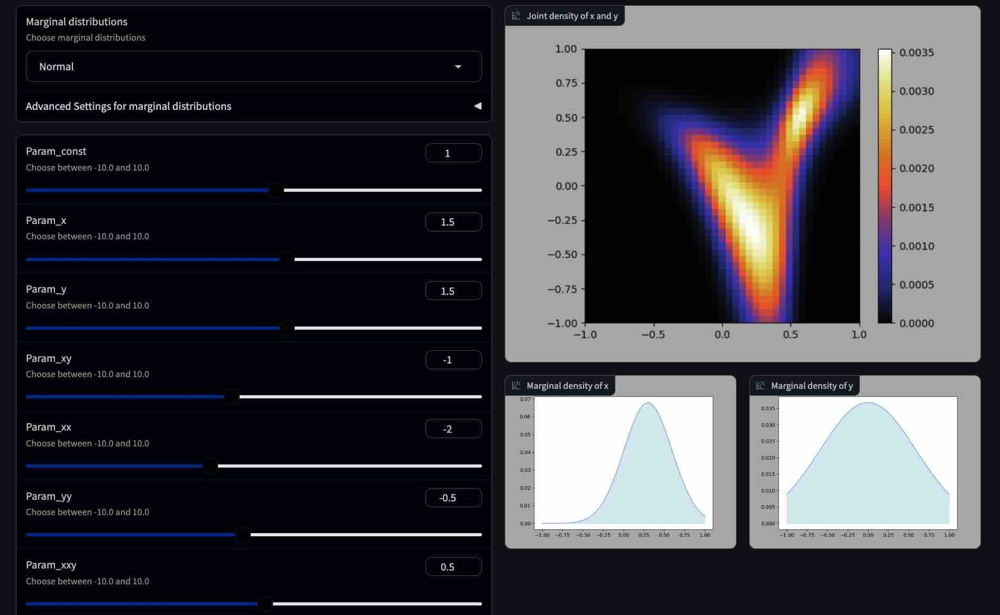

# Mindemo2D

[English](README.en.md) &nbsp;&nbsp;&nbsp;&nbsp;&nbsp; [Japanese](README.jp.md)

## Overview

This program visualizes a two-dimensional probability distribution constructed using the [Minimum Information Dependence Model](https://arxiv.org/abs/2206.06792).

## Usage
To run the web app, execute the Python notebook file “mindemo2d.ipynb”. The web app is created using [Gradio](https://github.com/gradio-app/gradio). For information on installing [Gradio](https://github.com/gradio-app/gradio), refer to this link [https://github.com/gradio-app/gradio](https://github.com/gradio-app/gradio).

## About Mindemo
Mindemo stands for “[Minimum Information Dependence Modeling](https://github.com/kyanostat/min-info)”. It is a highly flexible model capable of handling various interactions. In this program, we calculate probability functions using the Sinkhorn-Knopp algorithm for optimal transport based on the descriptions in the [Minimum Information Dependence Model](https://arxiv.org/abs/2206.06792) paper. For models with dimensions higher than three, we implement the Sinkhorn-Knopp algorithm for multi-marginal optimal transport, ensuring scalability. Keep in mind that running the Sinkhorn-Knopp algorithm for parameter updates can be computationally intensive. Additionally, setting the step size too small may lead to convergence issues.

## Mindemo3D

We’ve also created a TypeScript program called [Mindemo3D](https://github.com/tanaken-basis/mindemo3d) that visualizes a three-dimensional probability distribution constructed using the [Minimum Information Dependence Model](https://arxiv.org/abs/2206.06792). You can experience the demo web page [here](https://tanaken-basis.github.io/mindemo3d/).

Feel free to explore the interactive visualization and see the fascinating results!🌟

