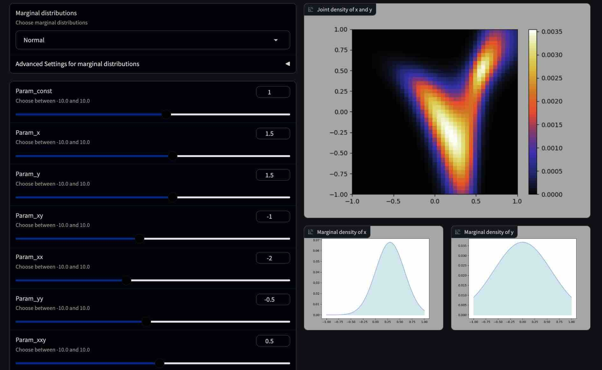

# Mindemo2D

[English](README.en.md) &nbsp;&nbsp;&nbsp;&nbsp;&nbsp; [日本語](README.jp.md)

## 概要

[最小情報従属モデル](https://arxiv.org/abs/2206.06792)(Mindemo)を用いて構成した2次元の確率分布を可視化するプログラムです。

## 使い方

Pythonのノートブックのファイル"mindemo2d.ipynb"を実行することで、Webアプリが起動します。
なお、Webアプリの作成のために [Gradio](https://github.com/gradio-app/gradio) を使用しています。
[Gradio](https://github.com/gradio-app/gradio) のインストールについては、https://github.com/gradio-app/gradio を参照してください。

## Mindemoについて

Mindemoは、[最小情報従属モデル(Minimum Information Dependence Model)](https://github.com/kyanostat/min-info)の略称です。Mindemoは、様々な交互作用を取り扱うことができる非常に柔軟性の高いモデルです。このプログラムでは、[最小情報従属モデルの論文](https://arxiv.org/abs/2206.06792)における記述をもとに、最適輸送における Sinkhorn-Knopp アルゴリズムを用いて確率関数を計算しています。なお、3次元以上のモデルにおいては、multi-marginal optimal transport に対する Sinkhorn-Knopp アルゴリズム が必要になり、このプログラムにおいても拡張性を見据えてその実装を行っています。確率関数のパラメーターの値を更新するたびに Sinkhorn-Knopp アルゴリズムを実行しているので、それなりに計算時間がかかります。また、ステップサイズを小さくしすぎると計算できなくなるかもしれません。

## Mindemo3Dについて

[最小情報従属モデル](https://arxiv.org/abs/2206.06792)を用いて構成した3次元の確率分布を可視化する[Mindemo3D](https://github.com/tanaken-basis/mindemo3d)という名前のTypeScriptのプログラムを[こちら](https://github.com/tanaken-basis/mindemo3d)に用意しています。[デモ用のWebページ](https://tanaken-basis.github.io/mindemo3d/)ですぐに体験できますのでご覧ください。

